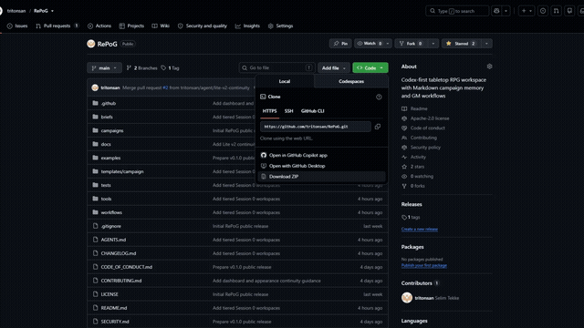
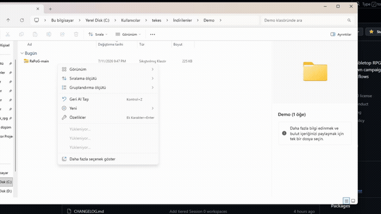
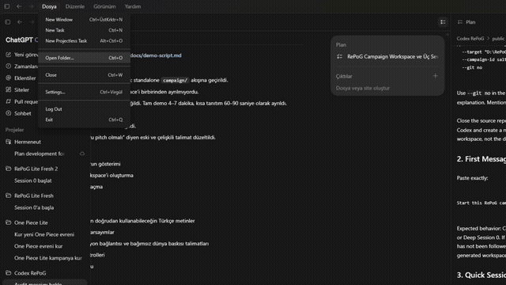
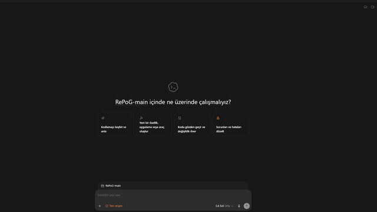

# RePoG Workspace

RePoG turns an agentic coding workspace into a long-form solo tabletop RPG Game
Master. This repository is the ready-to-play workspace: download the ZIP, open
the extracted folder, and start a new conversation.

## Watch the Demo

[](https://youtu.be/jpXtyfrd5k0)

▶ **[Watch the full RePoG demo on YouTube](https://youtu.be/jpXtyfrd5k0)**

## Start

<details>
<summary><strong>Show the four-step installation guide</strong></summary>

The interface language and exact layout may differ from the recordings, but the
four steps are the same.

### 1. Download the workspace

On GitHub, select **Code → Download ZIP**.



The current repository file list may look simpler than the recording because
the public download has since been reduced to the clean player workspace.

### 2. Extract the ZIP

Extract the archive into a new folder. You may rename that folder for your
campaign.



### 3. Open the folder

In Codex, select **Open Folder** and choose the extracted workspace. The same
folder can also be opened in Claude Code or another agentic coding tool.



### 4. Start Session 0

Start a new conversation in the opened workspace and send:

```text
Start this RePoG campaign and guide me through Session 0.
```



Choose Quick, Standard, or Deep Session 0 and answer naturally.

</details>

The included `campaign/` folder is blank campaign memory. The agent fills and
maintains it while you focus on the character, world, and choices. You do not
need to copy templates, run an installer, clone a development repository, or
understand the file structure before playing.

## Session 0 Depth

- **Quick:** 6–8 decisions, roughly 10–15 minutes.
- **Standard:** 17 core modules, roughly 30–60 minutes.
- **Deep:** adaptive detail packs, normally 30–45 decisions and 60–120 minutes.

All modes use the same continuity model. Quick records visible defaults;
Standard gives a balanced setup; Deep opens only the detail packages relevant
to the chosen campaign.

## Turn Speed And Continuity

Session 0 also asks how much maintenance each turn should perform:

- **Fast (recommended):** saves current truth immediately and batches
  secondary notes at scene boundaries or after five durable turns.
- **Balanced:** reconciles secondary notes at important beats or after three
  durable turns.
- **Maximum Continuity:** updates every affected note and runs full checks on
  every durable turn.
- **Custom:** lets you tune the cadence without disabling core continuity
  safeguards.

The setup interview shows typical wait ranges and separately explains the
extra time for dashboard refreshes and generated images. These are planning
estimates rather than guarantees.

## What RePoG Keeps Coherent

- current scene, fictional time, character state, inventory, and pressure;
- NPC location, activity, availability, natural presence, and independent next
  move;
- playable routes, access, traffic, and player-known locations;
- current relationships, debts, trust, tension, and information asymmetry;
- factions and offscreen world movement only when fiction triggers them;
- secrets and knowledge boundaries;
- progression, companion development, arc closure, and next-act preparation;
- accepted visuals and the optional player-safe dashboard.

During play, these notes and checks remain behind the curtain. The player
speaks in natural language and receives the living world, not technical state.

## Optional Dashboard

After Session 0, open the local player dashboard with:

```bash
python -m http.server 8787 --directory campaign/dashboard
```

Then visit `http://localhost:8787/`. The dashboard is read-only and contains
only player-known information. See [`docs/dashboard.md`](docs/dashboard.md).

## Optional Checks

```bash
python tools/check_state.py campaign --scope hot
python tools/check_state.py campaign --scope full
python tools/check_dashboard.py campaign/dashboard/dashboard_state.json
python tools/snapshot.py campaign --label before_scene
```

These are guardrails, not a second game engine.

## Workspace Contents

- `AGENTS.md`: durable GM and continuity rules.
- `CLAUDE.md`: compatibility bridge for Claude Code.
- `OPEN_CAMPAIGN.md`: first-conversation instructions.
- `workflows/`: worldbuilding, GM, distill, and audit procedures.
- `briefs/`: Session 0 interview guidance.
- `campaign/`: this game's readable memory and player dashboard.
- `tools/`: small local checks, snapshots, mechanics, and style helpers.

RePoG is licensed under the Apache License, Version 2.0. See [`LICENSE`](LICENSE).
